# devsecops-pipeline

A Go microservice wired to a full CI/CD pipeline where every security
gate is a real, enforced block — not a report nobody reads.

## Pipeline

The DAG below is the actual `jobs:` graph in
[`.github/workflows/ci.yml`](.github/workflows/ci.yml) — job names and
`needs:` edges are mirrored exactly, not summarized. Each job only runs
once every job it depends on has succeeded, so GitHub Actions itself
enforces this shape, not just the diagram.

```mermaid
flowchart LR
    test["test"] --> sast["sast"]
    sast --> build["build"]
    build --> scan["scan"]
    scan --> sign["sign"]
    sign --> push["push"]
    push --> deploy_staging["deploy-staging"]
    deploy_staging --> deploy_prod["deploy-prod"]
    deploy_prod -. on failure .-> rollback["rollback"]

    classDef gate fill:#ffdddd,stroke:#c0392b,stroke-width:2px;
    classDef manual fill:#fff3cd,stroke:#b8860b,stroke-width:2px;
    class scan gate;
    class deploy_prod manual;
```



- **Red (`scan`)** is the blocking Trivy gate — HIGH/CRITICAL CVEs with a
  known fix stop the pipeline. Proven on a real run in
  [`docs/PROOF.md`](docs/PROOF.md).
- **Yellow (`deploy-prod`)** runs under a `production` GitHub
  Environment with required reviewers — a human has to click approve.
- **`rollback`** only runs `if: failure()` on `deploy-prod`, and reverts
  the GitOps repo's production image tag back to whatever was deployed
  before, then re-syncs ArgoCD.
- `deploy-staging` only runs on a direct push to `main`
  (`github.ref == 'refs/heads/main' && github.event_name == 'push'`), so
  pull request runs stop after `push` (image built, scanned, signed —
  but nothing deployed).

`.github/workflows/vulnerable-demo.yml` is a separate, deliberately
failing workflow (see below) — it is not part of this DAG and cannot
block it.

## Security gates

| Tool | What it catches | Blocking or advisory |
| --- | --- | --- |
| `go vet` | Suspicious constructs, common Go bugs | **Blocking** — `test` job fails |
| `go test -race` | Regressions, data races | **Blocking** — `test` job fails |
| SonarCloud (SAST) | Bugs, code smells, security hotspots | Advisory — `continue-on-error: true` (no live SonarCloud org wired up in this portfolio repo yet; see Prerequisites) |
| Semgrep (SAST fallback) | OWASP / Go security anti-patterns | **Blocking** — always-on safety net so `sast` still enforces something even when SonarCloud is unavailable |
| Trivy image scan | OS package + library CVEs in the built container | **Blocking** on HIGH/CRITICAL with an available fix (`exit-code: 1`, `ignore-unfixed: true`) — see [`docs/PROOF.md`](docs/PROOF.md) for a run where this actually fails the build |
| Cosign keyless signing + verify | Unsigned or tampered images reaching production | **Blocking** — the `push` job verifies the Sigstore signature before promoting the `stable` tag |
| Syft SBOM + Cosign attestation | Supply-chain provenance / composition | Advisory — recorded and attached to the image, not itself a gate |
| ArgoCD health check + smoke tests | Broken deploys | **Blocking** — job failure in `deploy-prod` triggers `rollback` |
| Manual approval (`production` environment) | Unreviewed production releases | **Blocking** — GitHub required reviewers on the environment |

## Prerequisites

None of this runs out of the box — that's intentional; a pipeline that
"just works" against nothing isn't proving anything. Everything below is
a **placeholder** you must fill in with real values for your own AWS
account, SonarCloud org, GitOps repo, ArgoCD instance, and Vault
cluster before pushing to `main` will get past the `sign` job.

**AWS / ECR** (Settings → Secrets and variables → Actions → Variables)

| Name | Placeholder value | Notes |
| --- | --- | --- |
| `AWS_REGION` | e.g. `us-east-1` | **placeholder** |
| `AWS_ROLE_ARN` | `arn:aws:iam::<ACCOUNT_ID>:role/<role-name>` | **placeholder** — an IAM role trusting GitHub's OIDC provider (`token.actions.githubusercontent.com`), scoped to this repo. No long-lived AWS keys are used; `sign`/`push` assume this role via `permissions.id-token: write`. |
| `ECR_REGISTRY` | `<ACCOUNT_ID>.dkr.ecr.<region>.amazonaws.com` | **placeholder** |
| `ECR_REPOSITORY` | e.g. `devsecops-pipeline/app` | **placeholder** — must already exist in ECR |

**SonarCloud**

| Name | Kind | Notes |
| --- | --- | --- |
| `SONAR_TOKEN` | Secret | **placeholder** — SonarCloud falls back to Semgrep (still blocking) if unset, see the Security gates table |
| `SONAR_ORGANIZATION` | Variable | **placeholder** |
| `SONAR_PROJECT_KEY` | Variable | **placeholder** |

**GitOps / ArgoCD**

| Name | Kind | Notes |
| --- | --- | --- |
| `GITOPS_REPO` | Variable | **placeholder** — `owner/repo` of the separate Kustomize/GitOps repo `deploy-staging`/`deploy-prod`/`rollback` push image-tag bumps to |
| `GITOPS_REPO_TOKEN` | Secret | **placeholder** — PAT (or GitHub App token) with push access to `GITOPS_REPO` |
| `ARGOCD_SERVER` | Variable | **placeholder** |
| `ARGOCD_STAGING_APP` / `ARGOCD_PROD_APP` | Variables | **placeholder** — ArgoCD Application names |
| `ARGOCD_AUTH_TOKEN` | Secret | **placeholder** |
| `STAGING_URL` / `PROD_URL` | Variables | **placeholder** — base URLs `smoke-tests/smoke-test.sh` polls after each deploy |

**Vault** (application runtime secrets, not consumed by `ci.yml` itself)

| Name | Notes |
| --- | --- |
| `VAULT_ADDR` | **placeholder** — e.g. `https://vault.example.internal:8200`, passed to [`vault/setup-k8s-auth.sh`](vault/setup-k8s-auth.sh) |
| Kubernetes cluster / namespace / ServiceAccount | **placeholder** — `KUBERNETES_HOST`, `K8S_NAMESPACE`, `K8S_SERVICE_ACCOUNT` in the same script |

See [`docs/VAULT.md`](docs/VAULT.md) for the full auth flow this
enables, and why it's used instead of storing application secrets as
more GitHub secrets.

## Run it locally

Unit tests + vet (same commands the `test` job runs):

```bash
cd app
go vet ./...
go test -race -covermode=atomic -coverprofile=coverage.out ./...
go tool cover -func=coverage.out
```

Build and run the container:

```bash
docker build -f app/Dockerfile -t devsecops-pipeline/app:local app
docker run --rm -p 8080:8080 devsecops-pipeline/app:local
curl -s http://localhost:8080/healthz
curl -s http://localhost:8080/version
```

Run the smoke tests against it (same script the pipeline runs
post-deploy):

```bash
SMOKE_TEST_URL=http://localhost:8080 ./smoke-tests/smoke-test.sh
```

## Proving the gates are real

[`docs/PROOF.md`](docs/PROOF.md) walks through pushing a
`demo/vulnerable` branch that builds
[`app/Dockerfile.vulnerable`](app/Dockerfile.vulnerable) — same app, EOL
`ubuntu:16.04` base, root user — through
[`.github/workflows/vulnerable-demo.yml`](.github/workflows/vulnerable-demo.yml),
and watching the Trivy gate actually fail the job. Exact commands,
expected output, and a placeholder for the failed-run screenshot are all
in that document.

## Stack

Go · GitHub Actions · Docker (Buildx) · Trivy · SonarCloud + Semgrep ·
Syft (SBOM) · Cosign (keyless signing) · Amazon ECR · ArgoCD ·
HashiCorp Vault (Kubernetes auth)

## Status

In progress. The application, CI pipeline, vulnerable-image proof, and
Vault integration docs are complete; the values in
[Prerequisites](#prerequisites) still need to be pointed at a real AWS
account, SonarCloud org, GitOps repo, ArgoCD instance, and Vault cluster
before an end-to-end run will go green.
