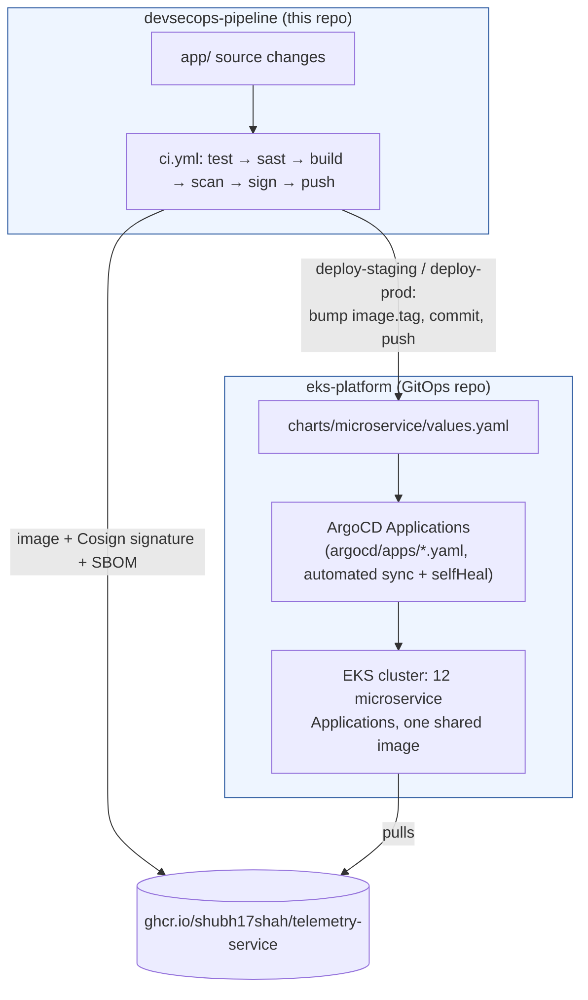

# devsecops-pipeline

The application-delivery repo for **telemetry-service**: source, tests,
and a CI/CD pipeline where every security gate is a real, enforced block —
not a report nobody reads. This repo builds, tests, scans, signs, and
pushes the container image; a separate GitOps repo,
[`shubh17shah/eks-platform`](https://github.com/shubh17shah/eks-platform),
holds the Terraform, Helm chart, and ArgoCD Applications that deploy it to
EKS.

## The application

[`app/`](app) is `telemetry-service`, a Node.js/Express service. The same
image this repo builds backs all 12 microservice Applications in
`eks-platform` — identity and enabled dependencies (Postgres/Redis/
RabbitMQ) are driven entirely by environment variables, not by 12
separate codebases. See [`app/README.md`](app/README.md) for the full
rationale, endpoint list, and environment variable reference.

## How this repo relates to eks-platform

This repo owns the application and its CI. `eks-platform` owns
infrastructure and the desired-state manifests ArgoCD reconciles against.
The loop between them is push-based CI on this side and pull-based GitOps
on the other:


```mermaid
flowchart TB
    subgraph appRepo["devsecops-pipeline (this repo)"]
        code["app/ source changes"] --> ci["ci.yml: test → sast → build → scan → sign → push"]
    end

    ci -- "image + Cosign signature + SBOM" --> ghcr[("ghcr.io/shubh17shah/telemetry-service")]
    ci -- "deploy-staging / deploy-prod:\nbump image.tag, commit, push" --> gitops

    subgraph platformRepo["eks-platform (GitOps repo)"]
        gitops["charts/microservice/values.yaml"] --> argo["ArgoCD Applications\n(argocd/apps/*.yaml, automated sync + selfHeal)"]
        argo --> cluster["EKS cluster: 12 microservice\nApplications, one shared image"]
    end

    cluster -- "pulls" --> ghcr

    classDef repo fill:#eef5ff,stroke:#2c5aa0,stroke-width:1px;
    class appRepo,platformRepo repo;
```

Concretely: `eks-platform`'s `charts/microservice/values.yaml` sets
`image.repository: ghcr.io/shubh17shah/telemetry-service` once for every
service that chart backs. This pipeline's `deploy-staging` job bumps that
file's `image.tag` field to the just-signed commit SHA and pushes it;
every ArgoCD Application in `argocd/apps/` already runs with
`syncPolicy.automated.selfHeal: true`, so the new tag rolls out without a
human touching `kubectl` or the ArgoCD UI. `deploy-prod` is the human
checkpoint on top of that same rollout — see the `deploy-*` jobs in
[`ci.yml`](.github/workflows/ci.yml) for exactly what each one does and
why there's one shared image tag rather than separate staging/production
overlays (that cluster's own resource footprint — a 2-node `t3.small`
group — is documented in `eks-platform`'s `charts/microservice/values.yaml`).

## Pipeline

The DAG below is the actual `jobs:` graph in
[`.github/workflows/ci.yml`](.github/workflows/ci.yml) — job names and
`needs:` edges are mirrored exactly, not summarized. Each job only runs
once every job it depends on has succeeded, so GitHub Actions itself
enforces this shape, not just the diagram.


```mermaid
flowchart LR
    test["test"] --> sast["sast"]
    sast --> build["build"]
    build --> scan["scan"]
    scan --> sign["sign"]
    sign --> push["push"]
    push --> deploy_staging["deploy-staging"]
    deploy_staging --> deploy_prod["deploy-prod"]
    deploy_prod -. on failure .-> rollback["rollback"]

    classDef gate fill:#ffdddd,stroke:#c0392b,stroke-width:2px;
    classDef manual fill:#fff3cd,stroke:#b8860b,stroke-width:2px;
    class scan gate;
    class deploy_prod manual;
```

- **Red (`scan`)** is the blocking Trivy gate — HIGH/CRITICAL CVEs with a
  known fix stop the pipeline. Continuously re-verified on a schedule in
  [`docs/SECURITY-GATES.md`](docs/SECURITY-GATES.md).
- **Yellow (`deploy-prod`)** runs under a `production` GitHub
  Environment with required reviewers — a human has to click approve.
- **`rollback`** only runs `if: failure()` on `deploy-prod`, and reverts
  `eks-platform`'s `charts/microservice/values.yaml` `image.tag` back to
  whatever was deployed before, then re-syncs ArgoCD.
- `deploy-staging` only runs on a direct push to `main`
  (`github.ref == 'refs/heads/main' && github.event_name == 'push'`), so
  pull request runs stop after `push` (image built, scanned, signed —
  but nothing deployed).

[`.github/workflows/verify-security-gates.yml`](.github/workflows/verify-security-gates.yml)
is a separate, scheduled workflow (see below) — it is not part of this
DAG and cannot block it.

## Security gates

| Tool | What it catches | Blocking or advisory |
| --- | --- | --- |
| ESLint (`npm run lint`) | Correctness bugs, unsafe comparisons, unused vars | **Blocking** — `test` job fails |
| `node --test` | Regressions in route/handler behavior | **Blocking** — `test` job fails |
| SonarCloud (SAST) | Bugs, code smells, security hotspots | Advisory — `continue-on-error: true` when `SONAR_TOKEN` isn't configured (see Configuration) |
| Semgrep (SAST fallback) | Node.js / Express security anti-patterns | **Blocking** — always-on safety net so `sast` still enforces something even when SonarCloud is unavailable |
| Trivy image scan | OS package + npm dependency CVEs in the built container | **Blocking** on HIGH/CRITICAL with an available fix (`exit-code: 1`, `ignore-unfixed: true`) — see [`docs/SECURITY-GATES.md`](docs/SECURITY-GATES.md) for a scheduled run that verifies this gate keeps failing on a known-bad image |
| Cosign keyless signing + verify | Unsigned or tampered images reaching production | **Blocking** — the `push` job verifies the Sigstore signature before promoting the `stable` tag |
| Syft SBOM + Cosign attestation | Supply-chain provenance / composition | Advisory — recorded and attached to the image, not itself a gate |
| ArgoCD health check + smoke tests | Broken deploys | **Blocking** — job failure in `deploy-prod` triggers `rollback` |
| Manual approval (`production` environment) | Unreviewed production releases | **Blocking** — GitHub required reviewers on the environment |

## Configuration

`ci.yml` needs the following repository configuration
(Settings → Secrets and variables → Actions) before a push to `main` will
get past the `sign` job.

**Variables**

| Name | Example value | Used by |
| --- | --- | --- |
| `SONAR_ORGANIZATION` | `your-sonarcloud-org` | `sast` — SonarCloud org key |
| `SONAR_PROJECT_KEY` | `shubh17shah_devsecops-pipeline` | `sast` — SonarCloud project key |
| `GITOPS_REPO` | `shubh17shah/eks-platform` | `deploy-staging`, `rollback` — repo the image-tag bump is pushed to |
| `ARGOCD_SERVER` | `argocd.internal.example` | `deploy-staging`, `deploy-prod`, `rollback` — ArgoCD API server the `argocd` CLI targets |
| `ARGOCD_APPS` | `telemetry-ingest telemetry-query` | `deploy-staging`, `deploy-prod`, `rollback` — space-separated ArgoCD Application names to sync/wait on (see `eks-platform`'s `argocd/apps/`) |
| `STAGING_URL` | `http://telemetry-ingest.apps.svc.cluster.local` | `deploy-staging` — base URL `smoke-tests/smoke-test.sh` polls |
| `PROD_URL` | `https://telemetry.example-platform.internal` | `deploy-prod`, `rollback` — base URL for the post-approval health check |

**Secrets**

| Name | Used by | Notes |
| --- | --- | --- |
| `SONAR_TOKEN` | `sast` | SonarCloud falls back to Semgrep (still blocking) if unset — see the Security gates table |
| `GITOPS_REPO_TOKEN` | `deploy-staging`, `deploy-prod`, `rollback` | PAT or GitHub App token with push access to `GITOPS_REPO` |
| `ARGOCD_AUTH_TOKEN` | `deploy-staging`, `deploy-prod`, `rollback` | ArgoCD API token used by the `argocd` CLI |

`GITHUB_TOKEN` (automatically provided by Actions) authenticates the
`sign` and `push` jobs' `ghcr.io` login and Cosign's Sigstore Fulcio
step — no separate registry credential needs to be provisioned for the
default GHCR path.

**AWS / ECR (optional alternative registry)**

`ci.yml`'s `sign` job includes a commented block for pushing to Amazon
ECR via GitHub's OIDC provider instead of (or alongside) GHCR, for when
this pipeline targets a live EKS cluster pulling from a private registry.
Enabling it needs `AWS_REGION`, `AWS_ROLE_ARN`, and `ECR_REPOSITORY` as
Variables — no long-lived AWS keys either way, since the role is assumed
via `permissions.id-token: write`.

**Vault** (application runtime secrets, not consumed by `ci.yml` itself)

| Name | Notes |
| --- | --- |
| `VAULT_ADDR` | e.g. `https://vault.internal:8200`, passed to [`vault/setup-k8s-auth.sh`](vault/setup-k8s-auth.sh) |
| `KUBERNETES_HOST` / `K8S_NAMESPACE` / `K8S_SERVICE_ACCOUNT` | Cluster, namespace, and ServiceAccount the app's pods run as, same script |

See [`docs/VAULT.md`](docs/VAULT.md) for the full auth flow this enables,
and why it's used instead of storing application secrets as more GitHub
secrets.

## Local development

```bash
cd app
npm install            # resolves deps and writes package-lock.json
npm run lint             # eslint src test
npm test                  # node --test test/  (pure unit/route tests, no infra required)
npm run dev                # nodemon src/server.js — all *_ENABLED default to false
```

With every `*_ENABLED` flag left at its default `false`, the service comes
up with no external dependencies at all. See
[`app/README.md`](app/README.md#environment-variables) for the full
variable reference, including how to point it at a local Postgres/Redis/
RabbitMQ.

Build and run the container:

```bash
docker build -f app/Dockerfile -t telemetry-service:local app
docker run --rm -p 8080:8080 telemetry-service:local
curl -s http://localhost:8080/healthz
curl -s http://localhost:8080/
```

Run the smoke tests against it (same script the pipeline runs
post-deploy):

```bash
SMOKE_TEST_URL=http://localhost:8080 ./smoke-tests/smoke-test.sh
```

## Verifying the gates stay real

[`docs/SECURITY-GATES.md`](docs/SECURITY-GATES.md) documents each gate's
enforcement mechanism and walks through
[`.github/workflows/verify-security-gates.yml`](.github/workflows/verify-security-gates.yml),
a scheduled (and manually dispatchable) workflow that builds
[`app/Dockerfile.vulnerable`](app/Dockerfile.vulnerable) — same app, EOL
`node:16-alpine` base, root user — and confirms the Trivy gate still
blocks it. Exact commands, expected output, and where the run evidence
lives are all in that document.

## Stack

Node.js (Express) · GitHub Actions · Docker (Buildx) · Trivy · SonarCloud
+ Semgrep · Syft (SBOM) · Cosign (keyless signing) · GitHub Container
Registry (GHCR) · ArgoCD · HashiCorp Vault (Kubernetes auth)
